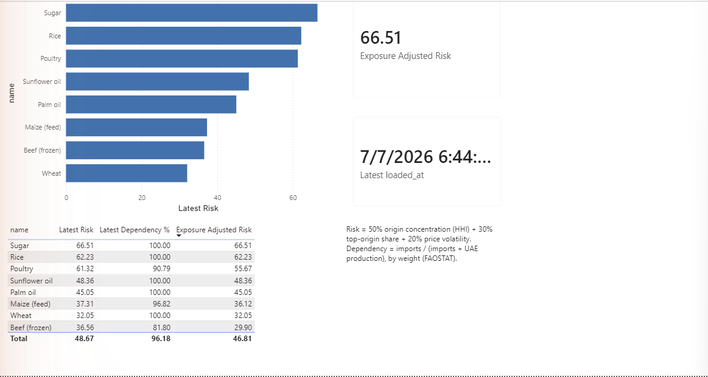
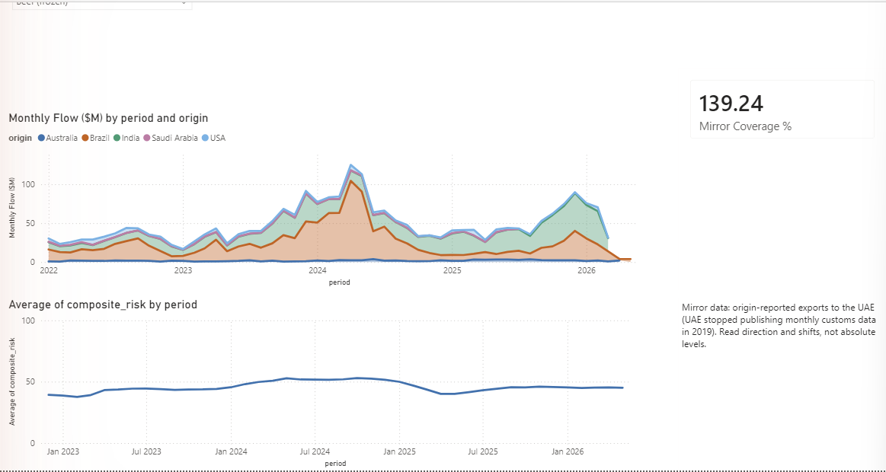
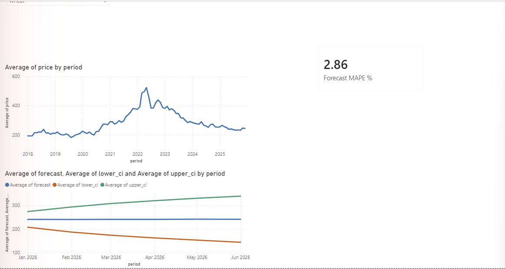

# QUTVIEW — Sovereign Food-Corridor Risk Intelligence (Prototype)

Early-warning risk intelligence for the UAE's strategic food import corridors.
Tracks five staple commodities (wheat, rice, palm oil, sugar, poultry), scores
each import corridor for concentration and volatility risk, and produces
baseline 6-month price forecasts with honestly backtested error rates.

**Stack:** Python 3.11 · SQLite (star schema) · pandas · statsmodels (SARIMAX) · Streamlit + Plotly

**Public data sources:** UN Comtrade (UAE import flows by origin), World Bank
Pink Sheet (monthly commodity prices). Every ingest script falls back to
realistic sample data if an API is unavailable, and the dashboard displays a
LIVE / SAMPLE provenance badge — the demo always runs.

## Quick start

```powershell
# 1. Create and activate a virtual environment
python -m venv .venv
.venv\Scripts\Activate.ps1

# 2. Install dependencies
pip install -r requirements.txt

# 3. Run the pipeline — one command does all of it, including the
#    Power BI CSV export (or run the steps individually, in this order)
python scripts/refresh_all.py        # or double-click refresh_all.bat

python src/db/init_db.py
python src/ingest/comtrade_imports.py           # add --sample to skip the API
python src/ingest/worldbank_prices.py           # add --sample to skip the download
python src/ingest/comtrade_mirror_monthly.py    # monthly mirror flows (needs API key)
python src/ingest/comtrade_mirror_annual.py     # annual mirror flows for years the UAE
                                                # hasn't published yet (needs API key)
python src/ingest/faostat_production.py         # UAE domestic production (FAOSTAT bulk)
python src/features/risk_indicators.py
python src/features/risk_indicators_monthly.py
python src/features/dependency_ratios.py
python src/models/forecast.py

# 4. Launch the dashboard
streamlit run app/dashboard.py

# 5. (Optional) Export CSVs for the Power BI report
python scripts/export_powerbi.py     # then follow docs/powerbi_guide.md

# 6. (Optional) Generated corridor brief in the terminal — LLM-written if
#    ANTHROPIC_API_KEY is set in .env, deterministic template otherwise.
#    Also shown on the dashboard for the selected commodity.
python src/brief/corridor_brief.py wheat        # add --facts to audit numbers
```

Refreshing later: `python scripts/refresh_all.py` re-pulls all sources and
re-exports the Power BI CSVs; then open [docs/QUTVIEW.pbix](docs/QUTVIEW.pbix)
and hit **Home → Refresh** — the report reads the CSVs live, so that one click
is the only manual step (Power BI Desktop has no unattended refresh).

## Project structure

```
├── app/dashboard.py               # Streamlit dashboard (risk cards, origins, forecasts, monthly monitor)
├── src/
│   ├── common.py                  # shared constants, DB helpers, commodity registry
│   ├── db/init_db.py              # SQLite star schema (dim/fact tables)
│   ├── ingest/
│   │   ├── comtrade_imports.py            # UAE annual import flows by origin (UN Comtrade)
│   │   ├── comtrade_mirror_monthly.py     # monthly flows via mirror statistics (origin-reported)
│   │   ├── comtrade_mirror_annual.py      # annual mirror flows extending past the last UAE-published year
│   │   ├── faostat_production.py          # UAE domestic production (FAOSTAT bulk file)
│   │   └── worldbank_prices.py            # monthly prices (World Bank Pink Sheet)
│   ├── features/
│   │   ├── risk_indicators.py             # annual HHI, dependency, volatility → composite risk
│   │   ├── risk_indicators_monthly.py     # rolling 12-month risk series from mirror flows
│   │   └── dependency_ratios.py           # import dependency vs domestic production
│   ├── brief/corridor_brief.py    # fact assembler + LLM/template corridor intelligence brief
│   └── models/forecast.py         # SARIMAX forecasts + backtested MAPE
└── data/qutview.db                # generated — not committed
```

## Risk methodology (v1)

Per commodity-year: **composite risk (0–100)** =
50% × origin-concentration HHI + 30% × top-origin import share + 20% × normalized
price volatility (stdev of monthly returns, capped at 10%). Forecasts are a
SARIMAX(1,1,1)(1,0,1,12) baseline; the dashboard reports the model's real
6-month holdout MAPE rather than claiming accuracy.

**Monthly corridor monitor (v2):** the UAE stopped publishing monthly customs
data to Comtrade after 2019, so monthly flows are reconstructed from *mirror
statistics* — each top origin's own reported exports to the UAE (FOB,
origin-reported). The same composite formula runs over a rolling 12-month
window, giving a risk series that reacts to corridor shifts within months.
Each commodity's mirror coverage is cross-checked against UAE-reported annual
imports and shown in the dashboard (51%–137%; wheat is lowest because Russia
stopped publishing trade data in 2022). Levels read higher than the annual
model because only top corridors are tracked — the series is for direction
and shift detection, not absolute comparison.

**Import dependency (v2):** imports / (imports + UAE domestic production),
by weight, using FAOSTAT production data. Most staples are 100% imported;
maize (~97%), poultry (~91%) and beef (~82%) have partial domestic cushions.
The dashboard shows an *exposure-adjusted risk* (corridor risk × import
dependency) alongside the raw corridor score. Approximations disclosed:
re-exports are not netted out, and HS import headings map only roughly to
FAO production items.

## Power BI report

A three-page Power BI report ([docs/QUTVIEW.pbix](docs/QUTVIEW.pbix)) built over the same
data as the Streamlit dashboard, via `scripts/export_powerbi.py` CSVs. Same CVD-safe
palette ([docs/qutview_theme.json](docs/qutview_theme.json)); build steps in
[docs/powerbi_guide.md](docs/powerbi_guide.md).

**Risk Overview** — corridor risk ranked, with import-dependency and exposure-adjusted
risk, and a data-freshness card:



**Monthly Corridor Monitor** — origin-level monthly flows (mirror statistics) and the
rolling 12-month composite risk series, with the mirror-coverage caveat on-canvas:



**Prices & Forecasts** — sliced per commodity (wheat shown: note the 2022 supply-shock
spike), 6-month SARIMAX forecast with 90% interval and the backtested MAPE:



## Roadmap

- [x] Phase 0–1: schema + ingestion (this repo)
- [x] Phase 2: corridor risk indicators
- [x] Phase 3: baseline forecasting with backtesting
- [x] Phase 4a: Streamlit dashboard
- [x] Registered UN Comtrade API key (authenticated endpoint, no preview rate caps)
- [x] Monthly granularity via mirror statistics + rolling 12-month risk series
- [x] Import-dependency ratios (FAOSTAT production data) + exposure-adjusted risk
- [x] Phase 4b: Power BI report over the same SQLite database
- [ ] AIS shipping-lane signals, satellite crop indices
